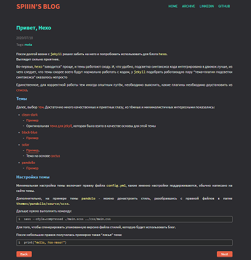

После нескольких дней возни в очередной попытке собрать на `jekyll` статический блог, решил забить на него и попробовать использовать для блога [hexo](https://hexo.io/). Получилось сильно проще и приятнее.

Во-первых, `hexo` запускается легче, и темы работают сходу. И, что удобно для блога программисту, подсветка синтаксиса кода интегрирована в движок лучше, из чего следует, что темы скорее всего будут совместимы с ней (у `jekyll` подобрать работающую пару "тема+плагин подсветки синтаксиса" оказалось очень непросто, то съезжала нумерация длинных строк, то весь блок с кодом выглядел коряво, то были проблемы с корректным отображения цвета строк или фона)

<!-- more -->

Единственное, для корректной работы тем, иногда опытным путём, необходимо выяснить, какие плагины необходимо доустановить из [списка](https://hexo.io/plugins/).

## Темы

Далее, выбор [тем](https://hexo.io/themes/). Достаточно много качественных и приятных глазу, из тёмных и минималистичных интересными показались:
+ [clean-dark](https://github.com/howardliu-cn/hexo-theme-clean-dark)
    + [Пример](https://www.howardliu.cn/)
    + Оригинальная [тема для jekyll](http://pavelmakhov.com/jekyll-clean-dark), которая была взята в качестве основы для этой темы
+ [black-blue](https://github.com/maochunguang/black-blue)
    + [Пример](http://maochunguang.github.io/)
+ [solar](https://github.com/tzvetkov75/solar-theme-hexo/)
    + [Пример](https://tzvetkov75.github.io/demo_blog/public/).
    + Тема на основе [cactus](https://probberechts.github.io/hexo-theme-cactus/cactus-dark/public/)
+ [pandollo](https://github.com/lyndonoc/hexo-theme-pandollo)
    + [Пример](https://lyndonoc.github.io/)


## Настройка темы

Минимальная настройка темы включает правку файла `config.yml`, какие именно настройки поддерживаются, обычно написано на сайте темы.

Дополнительно, на примере темы `pandolo` - можно донастроить стиль, разобравшись с правкой файлов в папке `themes/pandollo/source/scss`.

Дальше нужно выполнить команду:
```
sass --style=compressed ./main.scss ../css/main.css
```

Для того, чтобы сгенерировать упакованную версию файла стилей, которую будет использовать блог.

После небольших правок получилась примерно такая "лисья" тема:


## Настройка плагинов
Для выбранной темы пригодятся следующие плагины:
```json
  "dependencies": {
    ...
    "hexo-asset-link": "^2.0.1",
    "hexo-generator-fragments": "^1.0.0",
    "hexo-renderer-kramed": "^0.1.4",
    "hexo-renderer-jade": "^0.5.0",
    "hexo-abbrlink": "^2.2.1",
    ...
  }
```

[hexo-asset-link](https://github.com/liolok/hexo-asset-link) - позволяет использовать в постах ссылку на ассет в виде относительного пути: `POST_NAME/asset_name.png` (также нужно включить в `config.yml` опцию: `post_asset_folder: true`, чтобы hexo создавал отдельную папку для ассетов к каждому посту).

[hexo-generator-fragments](https://github.com/mamboer/hexo-generator-fragments) - необходим для темы - генерирует preview для постов для главной страницы, позволяет использоватьв в постах тег `<!-- more -->` чтобы отмечать краткую короткую preview-версию поста.

[hexo-renderer-kramed](https://github.com/sun11/hexo-renderer-kramed) - плагины, содержащие в названии renderer, позволяют hexo генерировать посты из разных форматов файла. Данный плагин используется для рендера из файлов `*.md` в формате `github flavored markdown`, который используется на серверах `github`.
В комплекте с `hexo` уже идёт плагин, который рендерит markdown-файлы, поэтому чтобы использовать альтернативный, предварительно нужно его удалить:
```
$ npm uninstall hexo-renderer-marked --save
```

[hexo-renderer-jade](https://github.com/hexojs/hexo-renderer-jade) - необходимый для темы плагин, позволяющий рендерить pug-файлы (собственно, сама тема описана в этом формате).

[hexo-abbrlink](https://github.com/Rozbo/hexo-abbrlink) - генерирует для каждого поста идентификатор. Для генерации имён постов необходимо в `config.yml` добавить строку:
```
permalink: posts/:abbrlink/
```
Для того, чтобы указать ссылку на пост, нужно использовать тег:
```

```

## Написание постов
После установки и настройки темы можно попробовать добавить пост:
```
hexo new post hello-hexo.md
```
Вместо md можно попробовать использовать другие форматы, для которых установлены render-плагины. В качестве редактора постов я бы посоветовал использовать (Visual Studio Code)[https://code.visualstudio.com/], вместе с плагином [Markdown Enchanced Preview](https://shd101wyy.github.io/markdown-preview-enhanced/#/).

Чтобы проверить, как выглядит пост, нужно запустить команду:
```
hexo serve
```
и открыть в браузере страницу `http://127.0.0.1:4000/` (hexo отслеживает изменения исходников и сразу обновляет открытую страницу).

Сгенерировать статический сайт можно так:
```
hexo clean
hexo generate
```

Весь сгенерированный сайт будет содержаться в папке `public`, её можно заливать на хостинг руками или воспользоваться плагинами для автоматизации этих процессов.

## Итог

В кажущейся простой задаче "отрендерить markdown-статью в html", cкрыт выбор целого стека способов решения (генераторы сайтов со своими языками, рендеры разных форматов и диалектов разметки, языки описания стилей и шаблонов сайта, темы, плагины, подсветка кода, системы развёртывания сайта).

В `hexo` эти вещи более-менее целостно сшиты вместе в единую систему, которой можно начать пользоваться достаточно быстро.